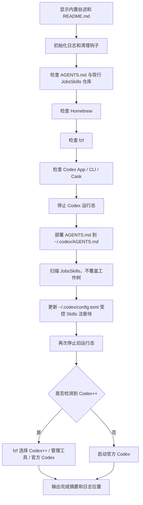

# `💻JobsCodexConfigs`


[toc]

---

## 🔥 <font id=前言>前言</font>

> `💻JobsCodexConfigs` 是 Jobs 本机 [**Codex**](https://openai.com/codex) 全局配置仓库，负责维护 `AGENTS.md`、挂载独立 [**JobsSkills**](https://github.com/JobsKits/JobsSkills) 子模块，并通过脚本部署全局指导与注册现行用户级 Skills。

全局规则以本仓库 `AGENTS.md` 为源头；专项 Skills 以 `$HOME/.agents/skills` 的 `JobsSkills` 工作树为现行基准。父仓中的 `skills` 只是子模块挂载和版本指针，不再保留一份由父仓直接跟踪的 Skills 备份。

---

## 一、项目定位 <a href="#前言" style="font-size:17px; color:green;"><b>🔼</b></a> <a href="#🔚" style="font-size:17px; color:green;"><b>🔽</b></a>

`💻JobsCodexConfigs` 面向 Jobs 本机 Codex 工作流，核心目标如下：

- 维护全局长期规则：仓库根目录 `AGENTS.md`。
- 维护专项规则：独立 `JobsSkills` 仓库中的 `<skill-name>/SKILL.md`。
- 记录聚合关系：`skills` 作为 `JobsSkills` 子模块，父仓只跟踪 gitlink 指针。
- 执行配置注入：部署 `AGENTS.md`，扫描现行 `JobsSkills` 工作树并更新 `~/.codex/config.toml` 受控注册块。

本仓库不做这些事：

- 不替换整个 `~/.codex`。
- 不清空 `~/.codex`、日志、会话、数据库或登录态。
- 不把 `~/.codex/AGENTS.md` 回写到仓库。
- 不用父仓备份反向覆盖 `$HOME/.agents/skills` 现行工作树。
- 不把所有专项规则重新塞回 `AGENTS.md`。

---

## 二、目录结构 <a href="#前言" style="font-size:17px; color:green;"><b>🔼</b></a> <a href="#🔚" style="font-size:17px; color:green;"><b>🔽</b></a>

```text
💻JobsCodexConfigs/
├── AGENTS.md
├── README.md
├── LICENSE
├── icon.png
├── config.toml（Token中转站的配置）.toml
├── 【MacOS】Codex配置注入替换工具.command
├── 【MacOS】⏬下载配置当前Git子模块.command
├── .gitmodules
└── skills/（JobsSkills Git 子模块）
```

关键文件说明：

| 文件 / 目录 | 作用 |
| --- | --- |
| `AGENTS.md` | Codex 全局指导源文件，部署到 `~/.codex/AGENTS.md`。 |
| `skills/` | `JobsSkills` Git 子模块挂载；父仓只记录子仓提交指针。 |
| `【MacOS】⏬下载配置当前Git子模块.command` | 下载、登记和同步 `JobsSkills` 子模块。 |
| `【MacOS】Codex配置注入替换工具.command` | 检查环境、部署 `AGENTS.md`、注册现行 `JobsSkills` 并重启 Codex；不覆盖 Skills 工作树。 |
| `config.toml（Token中转站的配置）.toml` | Token 中转站 / model provider 配置参考，不由脚本整文件部署。 |
| `README.md` | 本仓库说明文档，也是脚本运行前展示的主要自述。 |

---

## 三、部署目标 <a href="#前言" style="font-size:17px; color:green;"><b>🔼</b></a> <a href="#🔚" style="font-size:17px; color:green;"><b>🔽</b></a>

| 仓库来源 | 系统目标位置 | 部署行为 |
| --- | --- | --- |
| `AGENTS.md` | `~/.codex/AGENTS.md` | 创建 `~/.codex` 后覆盖写入全局指导文件。 |
| `$HOME/.agents/skills/*/SKILL.md` | `~/.codex/config.toml` | 扫描现行 `JobsSkills` 工作树，删除并重写 Jobs 受控的 `[[skills.config]]` 注册块。 |
| `skills` 子模块 | `💻JobsCodexConfigs` Git 索引 | 只记录 `JobsSkills` 提交指针，不覆盖用户级工作树。 |

可以用环境变量临时改目标：

```shell
TARGET_CODEX_DIR="$HOME/.codex" \
TARGET_SKILLS_DIR="$HOME/.agents/skills" \
TARGET_CODEX_CONFIG="$HOME/.codex/config.toml" \
./"【MacOS】Codex配置注入替换工具.command"
```

一般不需要改，默认位置就是当前 MacOS 用户固定位置。

---

## 四、运行方式 <a href="#前言" style="font-size:17px; color:green;"><b>🔼</b></a> <a href="#🔚" style="font-size:17px; color:green;"><b>🔽</b></a>

### 4.1、双击运行

- 在 [**Finder**](https://support.apple.com/guide/mac-help/welcome/mac) 中双击：

  ```text
  【MacOS】Codex配置注入替换工具.command
  ```

- 脚本启动后会先展示内置自述和本 `README.md`，确认无误后按回车继续。
- 确认前按 `Ctrl+C` 可以取消，不会继续执行部署流程。

### 4.2、终端运行

```shell
cd "."
chmod +x "【MacOS】Codex配置注入替换工具.command"
./"【MacOS】Codex配置注入替换工具.command"
```

### 4.3、子模块下载与同步

```shell
./"【MacOS】⏬下载配置当前Git子模块.command"
```

脚本只管理 `https://github.com/JobsKits/JobsSkills` 到父仓 `skills` 路径的子模块关系。

### 4.4、静态检查

修改脚本后，至少执行一次语法检查：

```shell
zsh -n "【MacOS】Codex配置注入替换工具.command"
zsh -n "【MacOS】⏬下载配置当前Git子模块.command"
```

---

## 五、执行前检查 <a href="#前言" style="font-size:17px; color:green;"><b>🔼</b></a> <a href="#🔚" style="font-size:17px; color:green;"><b>🔽</b></a>

执行脚本前建议确认：

| 检查项 | 说明 |
| --- | --- |
| 仓库位置 | 配置注入脚本必须能向上定位到包含 `AGENTS.md` 的仓库根目录。 |
| `AGENTS.md` | 必须存在，作为全局指导源文件。 |
| `JobsSkills` | `$HOME/.agents/skills` 必须是关联 `JobsKits/JobsSkills` 的 Git 工作树，且至少存在一个 `SKILL.md`。 |
| [**Homebrew**](https://brew.sh/) | 脚本会检测；不存在时会询问是否安装。 |
| [**fzf**](https://formulae.brew.sh/formula/fzf) | 用于 Codex++ 启动入口选择；不存在时会询问是否安装。 |
| [**Codex**](https://openai.com/codex) | 脚本会检查 App、CLI 或 Homebrew Cask；缺失时会询问是否安装。 |

涉及升级或安装的动作都需要用户交互确认；直接回车会跳过可选升级 / 自检项。

---

## 六、脚本执行流程 <a href="#前言" style="font-size:17px; color:green;"><b>🔼</b></a> <a href="#🔚" style="font-size:17px; color:green;"><b>🔽</b></a>



脚本主要动作：

1、展示 `README.md`，按回车后继续。

2、校验 `AGENTS.md` 与现行 `JobsSkills` Git 工作树。

3、检查 [**Homebrew**](https://brew.sh/)、[**fzf**](https://formulae.brew.sh/formula/fzf)、[**Codex**](https://openai.com/codex)。

4、停止当前 Codex 运行态，避免运行中读取旧配置。

5、覆盖部署 `AGENTS.md` 到 `~/.codex/AGENTS.md`。

6、扫描 `$HOME/.agents/skills`，收集 Skills 注册项，不复制、删除或覆盖仓库内容。

7、更新 `~/.codex/config.toml` 中 Jobs 受控的 Skills 注册块。

8、根据本机是否存在 Codex++，选择增强入口或官方 Codex 启动。

---

## 七、Skills 索引 <a href="#前言" style="font-size:17px; color:green;"><b>🔼</b></a> <a href="#🔚" style="font-size:17px; color:green;"><b>🔽</b></a>

全局长期行为写入本仓库 `AGENTS.md`，具体技术栈规则写入独立 `JobsSkills` 仓库对应 `<skill-name>/SKILL.md`。父仓的 `skills` 子模块只记录已采用版本。

| Skill | 适用场景 |
| --- | --- |
| `jobs-macos-shell` | MacOS 原生 Shell、zsh、`.sh`、`.command`、内置自述、防误触确认、函数拆分、`main` 入口、[**Homebrew**](https://brew.sh/)、自检、批量脚本、压缩包输出或 Sourcetree 自定义动作脚本。 |
| `jobs-git-repository` | `JobsMacEnvVarConfigs`、[**Git**](https://git-scm.com/) 仓库结构、安装与升级入口、仓库级配置同步规则。 |
| `jobs-markdown-docs` | [**Markdown**](https://markdown.cn)、`README.md`、技术文档、表格、流程图、外链、专有名词链接、文档封面和文档结构。 |
| `jobs-podspec` | [**CocoaPods**](https://cocoapods.org/)、`*.podspec`、`source_files`、`public_header_files`、`resource_bundles`、`xcconfig`、`JobsPodspecKit.rb` 或本地 Pod 发布配置。 |
| `jobs-objective-c-pods` | [**Objective-C**](https://developer.apple.com/library/archive/documentation/Cocoa/Conceptual/ProgrammingWithObjectiveC/Introduction/Introduction.html)、本地 Pods、Core / Support、头文件引用、Pod 拆分、`JobsDefineProperty`、`JobsOCDSL`、`JobsModelDSL`、`JobsBlock`、`JobsMake`、`import` 排序或 [**Xcode**](https://developer.apple.com/xcode) Markdown 引用。 |
| `jobs-swift` | [**Swift**](https://www.swift.org/)、Swift 文件组织、`JobsSwiftDSL`、点语法链式调用、懒加载、[**SnapKit**](https://github.com/SnapKit/SnapKit)、导航栏配置、控制器组织或 Swift `return self` 收口。 |
| `jobs-python` | [**Python**](https://www.python.org)、脚本、命令行入口、日志、异常、依赖、格式化、lint 或测试规则。 |
| `jobs-dart-flutter` | [**Dart**](https://dart.dev)、[**Flutter**](https://flutter.dev/)、Widget 拆分、状态管理、路由、资源、iOS / Android 打包、Gradle、Flutter SDK 或代码生成。 |

维护原则：

- 命中某类任务时，优先加载对应 Skill 的完整规则。
- 多领域任务可以组合多个 Skill，例如整理 `.command` 并写 `README.md` 时，同时参考 `jobs-macos-shell` 和 `jobs-markdown-docs`。
- Skill 内规则与 `AGENTS.md` 冲突时，`AGENTS.md` 只管全局边界，具体工程实践以对应 Skill 为准。

---

## 八、Codex 位置说明 <a href="#前言" style="font-size:17px; color:green;"><b>🔼</b></a> <a href="#🔚" style="font-size:17px; color:green;"><b>🔽</b></a>

### 8.1、全局指导文件

| 位置 | 说明 |
| --- | --- |
| `~/.codex/AGENTS.md` | Codex 全局指导文件。脚本会用本仓库根目录 `AGENTS.md` 覆盖部署到这里。 |
| `~/.codex/AGENTS.override.md` | 临时全局覆盖文件。正常长期规则不建议写这里。 |
| `<repo>/AGENTS.md` | 仓库级指导文件，适合某个具体项目的规则。 |
| `<repo>/子目录/AGENTS.md` | 子目录级规则，越靠近当前工作目录越具体。 |

`~/.codex/AGENTS.md` 是全局指导文件位置，不是 Skills 主目录。

### 8.2、Skills 位置

| 位置 | 作用 |
| --- | --- |
| `$HOME/.agents/skills` | 用户级 Skills，同时是现行 `JobsSkills` Git 基准工作树；配置注入脚本只读取并注册。 |
| `<repo>/.agents/skills` | 仓库级 Skills，适合项目团队共享。 |
| `$SYSTEM_CONFIG_DIR/codex/skills` | 管理员级 Skills，适合机器级共享。 |
| Codex 内置 | 系统级 Skills，由 Codex 自带。 |

Skill 基本结构：

```text
skill-name/
└── SKILL.md
```

`SKILL.md` 必须包含 `name` 和 `description` 元数据。Codex 会先读取技能名称、描述和路径，只有命中任务时才加载完整 `SKILL.md`。

### 8.3、Codex++ 管理器可见性

官方 Codex 会从 `$HOME/.agents/skills` 扫描用户级 Skills。Codex++ 管理器的「工具与插件 / Skills」页签通常展示 `~/.codex/config.toml` 中的 `[[skills.config]]` 条目。

脚本会维护如下受控块：

```toml
# >>> JobsCodexConfigs managed skills >>>
# 由 JobsCodexConfigs 配置注入脚本生成。
# 目的：让 Codex++ 管理器的 Skills 页签识别 JobsSkills 用户级仓库。
# 官方 Codex 的真实 Skill 文件仍位于：$HOME/.agents/skills

[[skills.config]]
path = "$HOME/.agents/skills/jobs-swift/SKILL.md"
enabled = true
# <<< JobsCodexConfigs managed skills <<<
```

脚本只删除并重写这段受控块，保留用户自己维护的 MCP、provider、plugin、projects 等配置。

---

## 九、风险说明 <a href="#前言" style="font-size:17px; color:green;"><b>🔼</b></a> <a href="#🔚" style="font-size:17px; color:green;"><b>🔽</b></a>

本脚本会修改当前用户环境，风险边界如下：

| 动作 | 风险 | 说明 |
| --- | --- | --- |
| 覆盖 `~/.codex/AGENTS.md` | 中 | 目标文件会被本仓库 `AGENTS.md` 覆盖。 |
| 扫描 `$HOME/.agents/skills` | 低 | 只读取 `SKILL.md` 路径用于生成注册块，不复制、删除或覆盖仓库。 |
| 更新 `~/.codex/config.toml` 受控块 | 低 | 只更新 `# >>> JobsCodexConfigs managed skills >>>` 到 `# <<< JobsCodexConfigs managed skills <<<` 之间内容。 |
| 停止 Codex 运行态 | 中 | 会尝试退出 `Codex` / `codex` 进程，必要时强制终止旧进程。 |
| 安装或升级工具 | 中 | [**Homebrew**](https://brew.sh/)、[**fzf**](https://formulae.brew.sh/formula/fzf)、Codex Cask 安装或升级都需要交互确认。 |

脚本不会清空 `~/.codex`，不会删除 Codex 会话、日志、数据库、登录态，也不会把系统运行态文件回写到仓库。

---

## 十、日志与排查 <a href="#前言" style="font-size:17px; color:green;"><b>🔼</b></a> <a href="#🔚" style="font-size:17px; color:green;"><b>🔽</b></a>

日志文件位于：

```text
$TMPDIR/【MacOS】Codex配置注入替换工具.log
```

常用排查命令：

```shell
tail -n 120 "$TMPDIR/【MacOS】Codex配置注入替换工具.log"
zsh -n "【MacOS】Codex配置注入替换工具.command"
ls -la "$HOME/.codex"
ls -la "$HOME/.agents/skills"
```

常见问题：

| 问题 | 处理方式 |
| --- | --- |
| 找不到 `AGENTS.md` | 确认脚本位于 `💻JobsCodexConfigs` 仓库内，或可从脚本所在目录向上找到仓库根目录。 |
| `JobsSkills origin 不匹配` | 确认 `$HOME/.agents/skills` 是从 `JobsKits/JobsSkills` 克隆的现行工作树。 |
| `fzf` 菜单无法显示 | 建议双击 `.command` 或在完整 Terminal TTY 中运行。 |
| Codex++ 未出现 | 脚本会回退启动官方 Codex；也可以手动打开 `$APPLICATIONS_DIR/Codex++.app` 或 `~/Applications/Codex++.app`。 |
| `config.toml` 注册不显示 | 确认 `~/.codex/config.toml` 中存在 Jobs 受控块，并确认对应 `SKILL.md` 路径存在。 |
| Skill 内容没生效 | 确认 `$HOME/.agents/skills/<skill-name>/SKILL.md` 已更新，并重启 Codex。 |

---

## 十一、维护原则 <a href="#前言" style="font-size:17px; color:green;"><b>🔼</b></a> <a href="#🔚" style="font-size:17px; color:green;"><b>🔽</b></a>

- `AGENTS.md` 以本仓库为源头；Skills 以独立 `JobsSkills` 仓库为源头。
- `💻JobsCodexConfigs/skills` 只是子模块挂载，父仓不直接跟踪其内部文件。
- 长期全局行为写 `AGENTS.md`。
- 专项技术栈规则以 `$HOME/.agents/skills/<skill-name>/SKILL.md` 现行工作树为基准。
- 修改专项规则后先在 `JobsSkills` 独立仓库提交、推送，再更新父仓子模块指针。
- 运行态数据库、日志、会话、认证文件不归本脚本管理。
- 修改脚本后执行 `zsh -n`，确认语法通过再运行。

<a id="🔚" href="#前言" style="font-size:17px; color:green; font-weight:bold;">我是有底线的➤点我回到首页</a>
