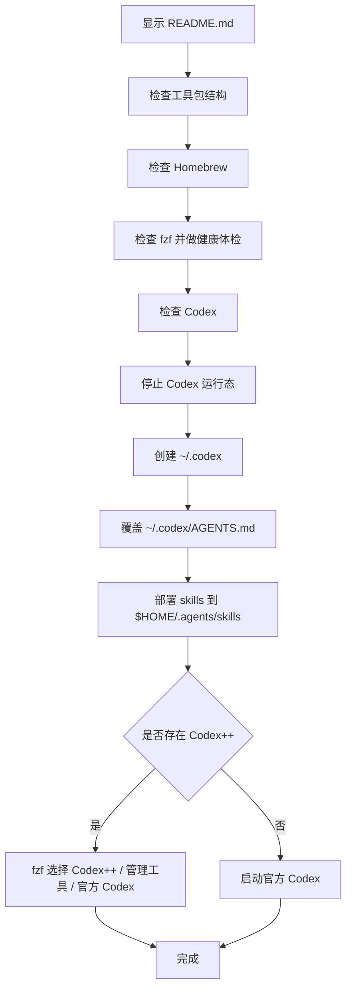

# 💻JobsCodexConfigs


[toc]

---

## 一、项目定位

`💻JobsCodexConfigs` 是 Jobs 本机 Codex 配置仓库，用于集中维护并单向部署 Codex 的全局指导文件与用户级 Skills。

核心目标只有一个：

> 启动 `【MacOS】Codex配置注入替换工具.command` 后，把本仓库内的 `AGENTS.md` 与 `skills/` 部署到当前 MacOS 用户的固定位置。

本仓库不做“从系统位置回写到仓库”的动作。脚本也不再维护多账户 `.codex` 来源目录，不会替换整个 `~/.codex`，只会覆盖 `~/.codex/AGENTS.md`、同步本仓库管理的 Skills，并在 `~/.codex/config.toml` 中维护一段 Jobs 受控的 `[[skills.config]]` 注册块，用于让 Codex++ 管理器可见。

---

## 二、目录结构

```text
💻JobsCodexConfigs/
├── AGENTS.md                                      # 全局指导源文件，部署到 ~/.codex/AGENTS.md
├── skills/                                        # Jobs Skills 源目录，部署到 $HOME/.agents/skills
│   ├── jobs-macos-shell/SKILL.md
│   ├── jobs-git-repository/SKILL.md
│   ├── jobs-markdown-docs/SKILL.md
│   ├── jobs-podspec/SKILL.md
│   ├── jobs-objective-c-pods/SKILL.md
│   ├── jobs-swift/SKILL.md
│   ├── jobs-python/SKILL.md
│   └── jobs-dart-flutter/SKILL.md
├── 【MacOS】Codex配置注入替换工具.command/
│   ├── 【MacOS】Codex配置注入替换工具.command
│   └── README.md
├── config.toml（Token中转站的配置）.toml           # 中转站 / model provider 配置参考，不由脚本整文件部署
├── LICENSE
├── .gitignore
└── README.md
```

---

## 三、脚本根目录识别说明

`【MacOS】Codex配置注入替换工具.command` 文件推荐放在同名文件夹内：

```text
💻JobsCodexConfigs/【MacOS】Codex配置注入替换工具.command/【MacOS】Codex配置注入替换工具.command
```

真实运行时，脚本会从自身所在目录开始向上查找，定位到同时包含 `AGENTS.md` 与 `skills/` 的 `💻JobsCodexConfigs` 根目录。也就是说，脚本隔着同名文件夹运行时，会自动向上跳一层，不会把脚本文件夹误判为配置仓库根目录。

---

## 四、部署位置

| 仓库来源 | 系统目标位置 | 行为 |
| --- | --- | --- |
| `AGENTS.md` | `~/.codex/AGENTS.md` | 创建 `~/.codex` 后覆盖写入该文件。 |
| `skills/*` | `$HOME/.agents/skills/*` | 逐个部署 Skill；同名 Skill 替换，其它 Skill 保留。 |

可通过环境变量临时改目标：

```shell
TARGET_CODEX_DIR="/Users/jobs/.codex" \
TARGET_SKILLS_DIR="/Users/jobs/.agents/skills" \
./"【MacOS】Codex配置注入替换工具.command"
```

一般不需要改，默认位置就是当前 MacOS 用户的固定位置。

---

## 五、Codex 固定位置说明

### 5.1、全局指导文件

| 位置 | 说明 |
| --- | --- |
| `~/.codex/AGENTS.md` | Codex 全局指导文件。脚本会用本仓库根目录 `AGENTS.md` 覆盖部署到这里。 |
| `~/.codex/AGENTS.override.md` | 临时全局覆盖文件。如果存在，Codex 会优先读取它。正常长期规则不建议写这里。 |
| `<repo>/AGENTS.md` | 仓库级指导文件，适合某个具体项目的规则。 |
| `<repo>/子目录/AGENTS.md` 或 `AGENTS.override.md` | 子目录级规则，越靠近当前工作目录越具体。 |

注意：`~/.codex/AGENTS.md` 是全局指导文件位置，不是 Skills 主目录。

### 5.2、Skills 位置

| 位置 | 作用 |
| --- | --- |
| `$HOME/.agents/skills` | 用户级 Skills。脚本会把本仓库 `skills/` 下的每个技能目录部署到这里。 |
| `<repo>/.agents/skills` | 仓库级 Skills，适合项目团队共享。 |
| `/etc/codex/skills` | 管理员级 Skills，适合机器级共享。 |
| Codex 内置 | 系统级 Skills，由 Codex 自带。 |

Skill 的基本结构：

```text
skill-name/
└── SKILL.md
```

`SKILL.md` 必须包含 `name` 和 `description` 元数据。Codex 会先读取技能名称、描述和路径，只有命中任务时才加载完整 `SKILL.md`，这样可以减少全局上下文负担。

### 5.3、Codex++ 管理器可见性

官方 Codex 会从 `$HOME/.agents/skills` 扫描用户级 Skills。Codex++ 管理器的「工具与插件 / Skills」页签通常展示 `~/.codex/config.toml` 中的 `[[skills.config]]` 条目。

因此，本脚本会在 `~/.codex/config.toml` 追加并维护如下受控块：

```toml
# >>> JobsCodexConfigs managed skills >>>
[[skills.config]]
path = "/Users/xxx/.agents/skills/jobs-swift/SKILL.md"
enabled = true
# <<< JobsCodexConfigs managed skills <<<
```

脚本只更新这段受控块，不会删除用户自己写的 MCP、provider、plugins、projects 等配置。

### 5.4、`~/.codex` 常见内容

| 文件 / 目录 | 说明 | 建议 |
| --- | --- | --- |
| `config.toml` | Codex 用户配置，例如模型、provider、sandbox、approval、hooks、skills.config 等。 | 脚本不会整文件覆盖，但会维护一段 Jobs 受控的 Skills 注册块。确需管理其它配置时手动处理，注意密钥不要明文入库。 |
| `AGENTS.md` | 全局指导文件。 | 由本仓库根目录 `AGENTS.md` 单向部署。 |
| `state_5.sqlite` | Codex 运行状态 SQLite 数据库文件。它是数据库文件，不是普通可手写配置。 | 不建议手动编辑，也不由本脚本部署。 |
| `logs*.sqlite` | Codex 日志数据库。 | 通常不需要入库。 |
| `sessions/` | Codex 会话数据。 | 体积可能较大，通常不入库。 |
| `auth*` / `credentials*` / token 相关文件 | 登录态或认证相关文件。 | 可能含敏感信息，不要随意提交远程仓库。 |

---

## 六、脚本部署行为

运行：

```shell
cd "💻JobsCodexConfigs/【MacOS】Codex配置注入替换工具.command"
chmod +x "【MacOS】Codex配置注入替换工具.command"
./"【MacOS】Codex配置注入替换工具.command"
```

脚本主要做这些事：

1. 展示脚本目录下的 `README.md`，按回车后继续。
2. 检查工具包结构：必须存在 `AGENTS.md` 与 `skills/*/SKILL.md`。
3. 检查 Homebrew、fzf、Codex 环境。
4. 停止当前 Codex 运行态，避免运行中读取旧配置。
5. 创建 `~/.codex`，并用本仓库 `AGENTS.md` 覆盖 `~/.codex/AGENTS.md`。
6. 把本仓库 `skills/*` 部署到 `$HOME/.agents/skills/*`。
7. 部署完成后重启 Codex：如果检测到 Codex++，使用 fzf 选择启动入口；如果没有 Codex++，启动官方 Codex。

脚本不会做这些事：

- 不会维护或读取多账户配置来源目录。
- 不会替换整个 `~/.codex`。
- 不会压缩、删除、清空已有 `~/.codex`。
- 不会整文件覆盖 `~/.codex/config.toml`，只会删除并重写 Jobs 受控的 Skills 注册块；不会修改 `state_5.sqlite`、日志、会话、认证文件。
- 不会把 `~/.codex/AGENTS.md` 回写到本仓库 `AGENTS.md`。
- 不会把 `$HOME/.agents/skills` 回写到本仓库 `skills/`。

---

## 七、执行流程



---

## 八、Skills 拆分说明

原 `AGENTS.md` 中的大量专项规则已拆分为独立 Skills：

| Skill | 适用场景 |
| --- | --- |
| `jobs-macos-shell` | MacOS Shell、zsh、`.command`、Homebrew、fzf、自检、批量脚本。 |
| `jobs-git-repository` | Git 仓库结构、JobsMacEnvVarConfigs、安装与升级入口规则。 |
| `jobs-markdown-docs` | Markdown、README、技术文档、表格、流程图、固定外链。 |
| `jobs-podspec` | CocoaPods、Podspec、source、资源、依赖、xcconfig。 |
| `jobs-objective-c-pods` | Objective-C、本地 Pods、Core/Support、头文件、JobsOCDSL、JobsMake。 |
| `jobs-swift` | Swift 文件基座、懒加载、SnapKit、导航栏、控制器组织。 |
| `jobs-python` | Python 脚本、命令行、日志、异常、依赖、测试。 |
| `jobs-dart-flutter` | Dart / Flutter 页面、状态、路由、资源、打包、代码生成。 |

后续维护建议：

- 全局长期行为写 `AGENTS.md`。
- 具体技术栈、脚本规范、文档规范写对应 `skills/<skill-name>/SKILL.md`。
- 不要把所有 Skill 内容重新塞回 `AGENTS.md`，否则会失去拆分意义。

---

## 九、Codex++ 启动说明

脚本部署完成后会重启 Codex。重启逻辑如下：

1. 先停止当前运行中的 Codex / codex 进程。
2. 检测固定 MacOS 应用路径：
   - `/Applications/Codex++.app`
   - `/Applications/Codex++ 管理工具.app`
   - `~/Applications/Codex++.app`
   - `~/Applications/Codex++ 管理工具.app`
3. 如果检测到 Codex++，使用 fzf 显示可启动入口，用户上下选择后启动。
4. 如果未检测到 Codex++，直接启动官方 Codex：
   - 优先 `/Applications/Codex.app`
   - 其次 `~/Applications/Codex.app`
   - 最后兜底 `open -a Codex`

---

## 十、维护原则

- 本仓库是源头，系统固定位置是部署目标。
- 部署是单向的：`💻JobsCodexConfigs` → 当前 MacOS 用户环境。
- 运行态数据库、日志、会话、认证文件不归本脚本管理。
- 修改脚本后至少执行静态检查：

  ```shell
  zsh -n "【MacOS】Codex配置注入替换工具.command/【MacOS】Codex配置注入替换工具.command"
  ```

<a id="🔚" href="#前言" style="font-size:17px; color:green; font-weight:bold;">我是有底线的➤点我回到首页</a>
