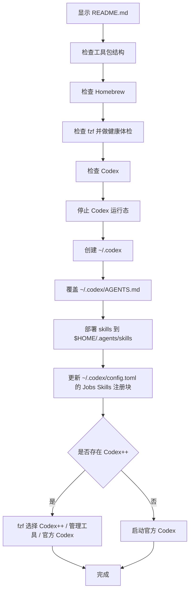

# `【MacOS】Codex配置注入替换工具.command`


[toc]

---

## 一、脚本用途

这个脚本用于把 `💻JobsCodexConfigs` 仓库里的 Codex 全局指导文件与 Skills，单向部署到当前 MacOS 用户的固定位置。

核心行为：

- 用仓库根目录 `AGENTS.md` 覆盖 `~/.codex/AGENTS.md`。
- 把仓库根目录 `skills/` 下的 Skills 部署到 `$HOME/.agents/skills`。
- 在 `~/.codex/config.toml` 中维护 Jobs 受控的 `[[skills.config]]` 注册块，让 Codex++ 管理器可见。
- 部署完成后重启 Codex；如果存在 Codex++，通过 fzf 让用户选择启动入口。

明确不做：

- 不读取多账户配置来源目录。
- 不替换整个 `~/.codex`。
- 不删除或压缩备份已有 `~/.codex`。
- 不整文件覆盖 `~/.codex/config.toml`，只维护 Jobs 受控的 Skills 注册块。
- 不修改 `state_5.sqlite`、日志、会话、认证文件。
- 不把 `~/.codex/AGENTS.md` 回写到仓库根目录 `AGENTS.md`。
- 不把 `$HOME/.agents/skills` 回写到仓库根目录 `skills/`。

---

## 二、部署位置

| 仓库来源 | 系统目标位置 | 说明 |
| --- | --- | --- |
| `AGENTS.md` | `~/.codex/AGENTS.md` | Codex 全局指导文件。 |
| `skills/*` | `$HOME/.agents/skills/*` | Codex 用户级 Skills。 |
| `skills/*/SKILL.md` | `~/.codex/config.toml` 的 Jobs 受控 `[[skills.config]]` 块 | 让 Codex++ 管理器的 Skills 页签可见。 |

可通过环境变量临时改目标：

```shell
TARGET_CODEX_DIR="/Users/jobs/.codex" \
TARGET_SKILLS_DIR="/Users/jobs/.agents/skills" \
./"【MacOS】Codex配置注入替换工具.command"
```

一般不需要改，默认位置就是当前 MacOS 用户的固定位置。

---

## 三、工具包目录要求

脚本既支持放在仓库根目录，也支持放在同名脚本文件夹内。当前推荐放在同名脚本文件夹内；真实运行时脚本会从自身所在目录开始向上查找，定位到同时包含 `AGENTS.md` 与 `skills/` 的 `💻JobsCodexConfigs` 根目录，避免把同名脚本文件夹误当成工具包根目录。

推荐结构：

```text
💻JobsCodexConfigs/
├── AGENTS.md
├── skills/
│   └── skill-name/
│       └── SKILL.md
└── 【MacOS】Codex配置注入替换工具.command/
    ├── 【MacOS】Codex配置注入替换工具.command
    └── README.md
```

---

## 四、执行前检查

脚本会依次检查：

| 检查项 | 行为 |
| --- | --- |
| 工具包结构 | 检查 `AGENTS.md`、`skills/*/SKILL.md`。 |
| Homebrew | 未安装时询问是否安装；已安装时可选择是否升级 / 自检。 |
| fzf | 未安装时询问是否 `brew install fzf`；已安装后执行 `fzf --version` 做健康体检。 |
| Codex | 检查 Codex cask、`Codex.app`、`codex` CLI；缺失时按交互提示处理。 |

普通升级 / 安装类操作遵循 Jobs 交互规则：直接回车跳过，输入任意字符后回车执行。

---

## 五、运行方式

双击运行：

```text
【MacOS】Codex配置注入替换工具.command
```

终端运行：

```shell
cd "💻JobsCodexConfigs/【MacOS】Codex配置注入替换工具.command"
chmod +x "【MacOS】Codex配置注入替换工具.command"
./"【MacOS】Codex配置注入替换工具.command"
```

脚本启动后会先显示本 README，确认后再进入真实部署流程。

---

## 六、执行流程



---

## 七、`~/.codex` 处理方式

脚本只会确保 `~/.codex` 目录存在，并覆盖其中的 `AGENTS.md`。

不会处理这些内容：

| 内容 | 行为 |
| --- | --- |
| `~/.codex/config.toml` | 不整文件覆盖；只删除并重写 Jobs 受控的 Skills 注册块。 |
| `~/.codex/state_5.sqlite` | 不读取、不覆盖、不删除。 |
| `~/.codex/logs*.sqlite` | 不读取、不覆盖、不删除。 |
| `~/.codex/sessions/` | 不读取、不覆盖、不删除。 |
| 登录态 / token / credentials | 不读取、不覆盖、不删除。 |

---

## 八、Skills 注入规则

脚本会扫描仓库根目录：

```text
skills/*/SKILL.md
```

然后部署到：

```text
$HOME/.agents/skills/skill-name/SKILL.md
```

如果目标中已经存在同名 Skill，脚本会替换该同名目录。脚本不会清空 `$HOME/.agents/skills` 下其它非本仓库管理的 Skill。

---

## 九、Codex++ 管理器可见性

官方 Codex 会扫描 `$HOME/.agents/skills` 中的用户级 Skills。Codex++ 管理器的 Skills 页签通常读取 `~/.codex/config.toml` 中的 `[[skills.config]]` 条目，所以只把 Skill 文件夹复制到 `$HOME/.agents/skills` 时，官方 Codex 可能可用，但 Codex++ 管理器里仍可能显示 0。

本脚本会在 `~/.codex/config.toml` 中维护一段 Jobs 受控配置块：

```toml
# >>> JobsCodexConfigs managed skills >>>
[[skills.config]]
path = "/Users/xxx/.agents/skills/jobs-swift/SKILL.md"
enabled = true
# <<< JobsCodexConfigs managed skills <<<
```

脚本只删除并重写这段受控块，不会删除用户自己维护的 MCP、provider、plugins、projects 等配置。

---

## 十、Codex++ 重启规则

部署完成后会重启 Codex：

1. 先尝试退出 `Codex` App。
2. 再终止仍在运行的 `Codex` / `codex` 进程。
3. 检测 MacOS 固定应用路径：
   - `/Applications/Codex++.app`
   - `/Applications/Codex++ 管理工具.app`
   - `~/Applications/Codex++.app`
   - `~/Applications/Codex++ 管理工具.app`
4. 如果存在 Codex++，弹出 fzf 菜单，让用户选择启动：
   - `Codex++` 增强启动器
   - `Codex++ 管理工具`
   - 官方 `Codex`
5. 如果不存在 Codex++，直接启动官方 `Codex`。

---

## 十一、Codex 配置说明

| 项 | 说明 |
| --- | --- |
| `~/.codex/AGENTS.md` | 全局指导文件。脚本由仓库根目录 `AGENTS.md` 单向覆盖。 |
| `$HOME/.agents/skills` | 用户级 Skills 目录。脚本由仓库根目录 `skills/` 单向部署。 |
| `<repo>/.agents/skills` | 仓库级 Skills 目录，适合某个项目内共享。 |
| `~/.codex/config.toml` | Codex 用户配置，可配置模型、provider、sandbox、approval、hooks、skills.config 等；本脚本只维护 Jobs 受控的 Skills 注册块，不整文件覆盖。 |
| `state_5.sqlite` | Codex 运行状态 SQLite 数据库文件，不建议手动编辑。 |
| `logs*.sqlite` | Codex 日志数据库，通常属于运行态数据。 |
| `sessions/` | 会话数据，可能体积较大。 |

---

## 十二、日志与验证

主脚本日志：

```text
/tmp/【MacOS】Codex配置注入替换工具.log
```

静态检查：

```shell
zsh -n "【MacOS】Codex配置注入替换工具.command"
```

如果当前环境不是 MacOS，无法真实验证 `open -a`、`.app` 路径和 GUI 启动，只能做静态语法检查。

---

## 十三、风险说明

- 脚本是单向部署工具，不是双向同步工具。
- 脚本不会替换整个 `~/.codex`，只覆盖 `~/.codex/AGENTS.md`。
- 同名 Skill 会被替换，但不会删除其它 Skill。随后会把这些 Skill 的 `SKILL.md` 路径写入 `~/.codex/config.toml` 的 Jobs 受控块。
- `state_5.sqlite`、日志数据库、会话、认证信息可能包含敏感或运行态数据，本脚本不管理这些内容。
- Codex++ 属于第三方增强启动器，检测到时只提供启动入口选择，不会安装或修改 Codex++ 本体。

<a id="🔚" href="#前言" style="font-size:17px; color:green; font-weight:bold;">我是有底线的➤点我回到首页</a>
